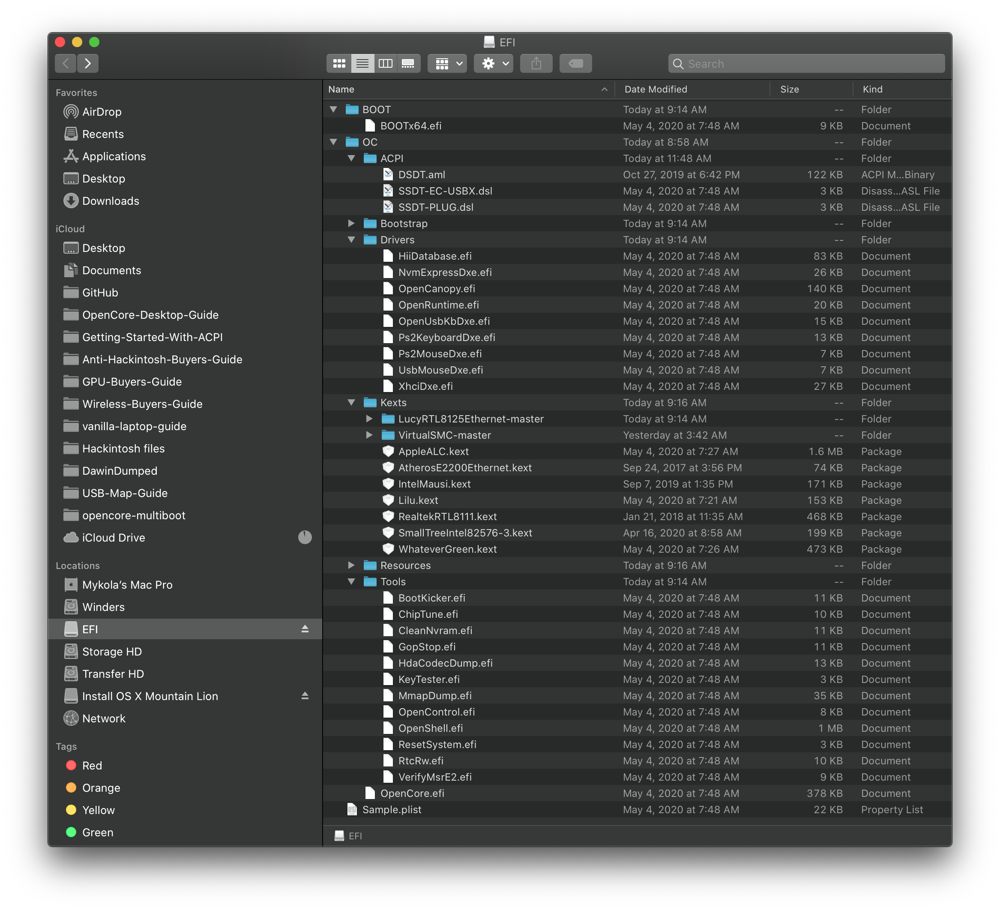

# Quá trình cài đặt

Sau khi bạn thiết lập OpenCore, bạn đã có thể boot, và bạn cần nên nhớ những thứ này:

- Thiết lập cài đặt BIOS tối ưu cho macOS
- Đọc bài [OpenCore Multiboot Guide](https://viopencore.github.io/OpenCore-Multiboot/) với là [Setting up LauncherOption](https://viopencore.github.io/OpenCore-Post-Install/multiboot/bootstrap)
  - Chủ yếu dành cho những người muốn dùng một ổ đĩa với đa hệ điều hành
- Và cả bản sao bài [General Troubleshooting](../troubleshooting/troubleshooting.md)
- Đọc bài [macOS Boot Process](../troubleshooting/boot.md)
  - Có thể giúp những người mới cài lần đầu hiểu hơn nơi mà có thể họ bị mắc kẹt lại
- Và cả tấn tính kiên nhẫn

## Kiểm tra lại công việc của bạn

Và thứ cuối cùng chúng ta cần phải trải qua trước khi boot chính là cách EFI của bạn được thiết lập:

|                        EFI tốt                        |                   EFI không tốt                    |
| :---------------------------------------------------: | :------------------------------------------------: |
|    |  |
|          Thư mục EFI nằm trong phân vùng EFI          |                 Thiếu thư mục EFI                  |
|             Tệp ACPI được compiled(.aml)              |         Tệp ACPI không được compiled(.dsl)         |
|                DSDT không được bao gồm                |                \* DSDT được bao gồm                |
|          Bỏ các Driver(.efi) không cần thiết          |                 Để Driver mặc định                 |
|          Bỏ các Tools(.efi) không cần thiết           |                  Để Tool mặc định                  |
| Tất cả tệp trong thư mục Kexts đều kết thúc với .kext |            Bao gồm thư mục và mã nguồn             |
|               config.plist nằm ở EFI/OC               |  Chưa đổi tên và đặt tệp .plist không đúng vị trí  |
|             Chỉ dùng những kext cần thiết             |         Tải về hết những kext được liệt ra         |

Và một nhắc nhở rằng trang slowgeek này là một người bạn của bạn:
_[Sanity Checker](https://opencore.slowgeek.com) chưa được update từ bản OpenCore 0.6.6, nếu bạn ở bản mới hơn thì không nên dùng_

## Boot USB OpenCore

Và bạn bây giờ có thể cắm USB vào máy tính của bạn và boot nó lên. Nên nhớ rằng đa số laptop và một số desktop sẽ vẫn mặc định khởi động vào ổ đĩa với Windows, và bạn sẽ cần phải chọn thủ công OpenCore trong lựa chọn boot BIOS. Bạn sẽ cần kiểm tra trong hướng dẫn sử dụng hoặc google để tìm ra nút Fn để truy cập BIOS và menu boot(VD. Esc, F2, F10 hoặc F12)

Một khi bạn boot USB, bạn sẽ được chào đón với những lựa chọn boot:

1. Windows
2. macOS Base System (External) / Install macOS Catalina (External)
3. OpenShell.efi
4. Reset NVRAM

Với chúng ta, **Option 2.** chính là cái mà chúng ta cần. Tuỳ vào cách bộ cài được tạo ra, nó sẽ xuất hiện dưới dạng **"macOS Base System (External)"** nếu được tạo ra trong Linux và Windows và **"Install macOS Catalina (External)"** nếu được tạo ra trong macOS.

## Cài đặt macOS

Và bạn đã có bộ cài được khởi động, đi qua verbose và đi vào cài đặt! Bây giờ bạn đã hiểu được, và đây là những điều chính mà bạn cần phải ghi nhớ:

- Ổ đĩa mà bạn muốn cài macOS lên **cần** phải là Bảng phân vùng GUID **và** APFS
  - High Sierra trên HDD và tất cả người dùng Sierra sẽ cần phải dùng macOS Journaled(HFS+)
- Ổ đĩa **cần** phải có phân vùng 200MB
  - Mặc định, macOS sẽ thiết lập format ổ đĩa với 200MB
  - Xem [Multiboot Guide](https://viopencore.github.io/OpenCore-Multiboot/) để biết thêm thông tin về cách phân vùng ổ đĩa Windows

Một khi bạn bắt đầu cài đặt, bạn sẽ cần phản phải chờ đến khi hệ thống khởi động lại. Bạn sẽ một lần nữa boot OpenCore, nhưng thay vì lựa chọn USB cài đặt/Khôi phục - bạn sẽ chọn bộ cài macOS trên ổ đĩa của bạn để tiếp tục cài đặt. Bạn sẽ thấy logo Apple xuất hiện, và sau vài phút bạn sẽ thấy thời gin đếm ngược ở phía dưới rằng "x minutes remaining". Đấy là một thời gian đủ để bạn có thể giải khát hoặc ăn vặt vì nó có thể mất một lúc lâu. Nó có thể khởi động lại vài lần, nhưng nếu mọi chuyện êm xuôi, nó sẽ làm bạn lao xuống tới "Set up your Mac"

Và bạn đã thành công! 🎉
Bạn sẽ muốn đi sang trang Post-Installation sau khi cài để hoàn thiện hệ thống của bạn.
