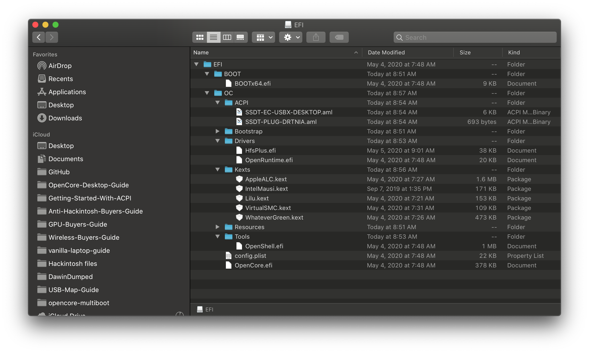

# Installation Process

Bây giờ bạn đã hoàn thành thiết lập OpenCore, bạn đã sẵn sàng boot, hãy chú ý những điều sau đây:

* Cài đặt BIOS sao cho thích hợp với macOS
* Đọc phần [Hướng dẫn Multiboot](https://viopencore.github.io/OpenCore-Multiboot/) và [Setting up LauncherOption](https://viopencore.github.io/OpenCore-Post-Install/multiboot/bootstrap)
  * Dành cho ai muốn chạy nhiều OS trên một ổ cứng
* Một bản [Gỡ lỗi chung](../troubleshooting/troubleshooting.md)
* Đọc phần [Quá trình boot của macOS](../troubleshooting/boot.md)
  * Giúp newbie hiểu rõ hơn về phần mà họ đang bị kẹt
* Và rất nhiều sự kiên nhẫn

## Xem lại USB

Chúng ta nên xem lại lần cuối EFI của mình trước khi boot: 

EFI tốt          |  EFI tệ
:-------------------------:|:-------------------------:
  |  
Thư mục EFI nằm trong phân vùng EFI | Thiếu thư mục EFI
Các file ACPI đã được compile(.aml) | Các file ACPI chưa được compile(.dsl)
Không có DSDT |* Có DSDT
Xóa các driver không cần thiết(.efi) | Để nguyên các driver đã cho
Xóa các công cụ không cần thiết(.efi) | Để nguyên các công cụ đã cho
Mọi file ở trong thư mục Kexts có đuôi .kext | Đi kèm mã nguồn và các thư mục
Có file config.plist tại EFI/OC | Chưa đổi tên hoặc chưa có file config.plist
Chỉ dùng những kext cần thiết | Sử dụng mọi kext

*[Sanity Checker](https://opencore.slowgeek.com) chưa được update từ bản OpenCore 0.6.6, nếu bạn ở bản mới hơn thì không nên dùng*

## Boot USB OpenCore

Bây giờ bạn đã bắt đầu cắm USB vào máy và bắt đầu boot. Nên nhớ rằng hầu hết laptop và một số desktop vẫn sẽ mặc định vào ổ cứng gắn trong với Windows, bạn cần phải chọn thủ công OpenCore trong boot menu. Bạn sẽ phải tự tìm cách vào boot menu và BIOS cho máy của bạn.

Một khi bạn đã boot vào USB, thường là một trong những tùy chọn sau đây sẽ hiện ra:

1. Windows
2. macOS Base System (External) / Install macOS Catalina (External)
3. OpenShell.efi
4. Reset NVRAM

**Tùy chọn 2** là thứ chúng ta cần. Tùy thuộc vào cách mà bộ cài được tạo, nó sẽ có tùy chọn **"macOS Base System (External)"** nếu bộ cài được tạo ở Windows/Linux và **"Install macOS Catalina (External)"** nếu được tạo ở macOS 

## macOS Installer

Bây giờ bộ cài đã boot thành công, vượt qua được màn hình verbose và vào được trình cài đặt, đây là những điều bạn cần chú ý:

* Ổ gắn trong mà bạn muốn cài macOS **phải** đều có kiểu phần vùng GUID **và** là APFS
  * Nếu bạn muốn cài bản High Sierra trên HDD và tất cả các bản macOS dươi Sierra thì phải dùng macOS Journaled(HFS+)
* Ổ gắn trong **cần phải có** một phân vùng 200MB
  * Theo mặc định, macOS sẽ tự động tạo một phân vùng 200MB trên các ổ trống hoàn toàn
  * Xem phần [Hướng dẫn Multiboot](https://viopencore.github.io/OpenCore-Multiboot/) để có thêm thông tin về cách phân vùng ổ đã cài Windows

Một khi bạn bắt đầu cài đặt, bạn sẽ muốn đợi cho đến khi máy khởi động lại. Một lần nữa bạn sẽ muốn boot vào OpenCore, nhưng thay vì chọn phân vùng recovery trên USB thì bạn sẽ chọn macOS Installer ở trên ổ gắn trong. Bạn sẽ thấy logo Apple, và sau vài phút bạn sẽ thấy phần thời gian còn lại "x minutes remaining". Máy sẽ tự khởi dộng lại một vài lần, nhưng nếu mọi chuyện đều suôn sẻ, cuối cùng bạn sẽ thấy màn hình "Set up your Mac"

Bạn đã cài xong! 🎉
Bạn sẽ muốn đọc phần Post-Installation (Sau khi cài) để hoàn tất.