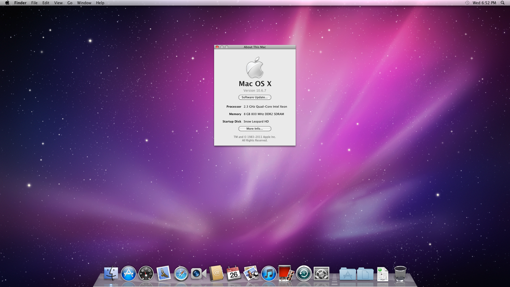
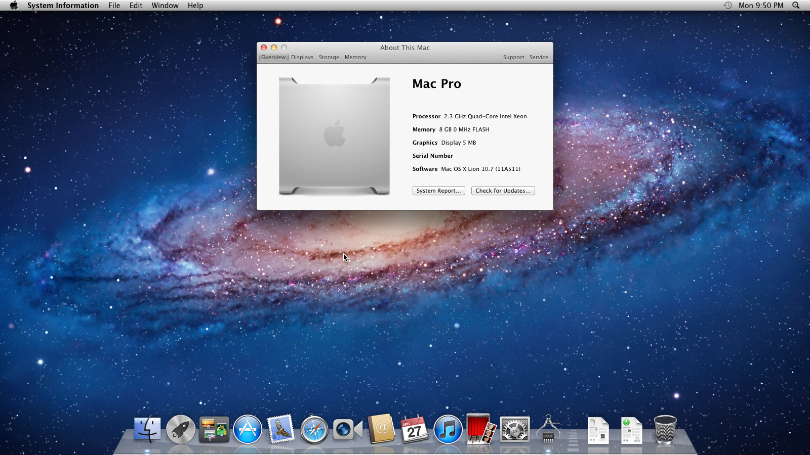
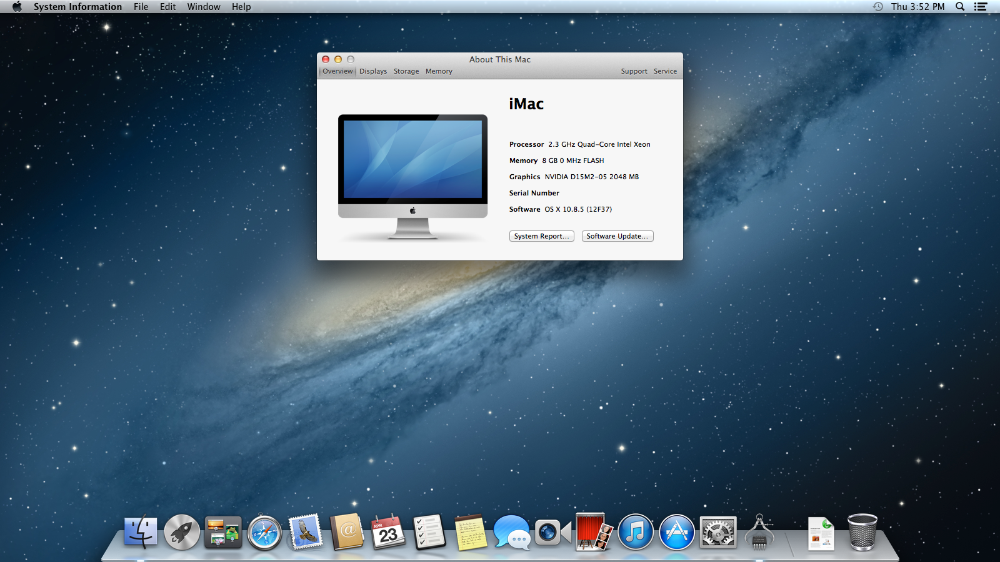
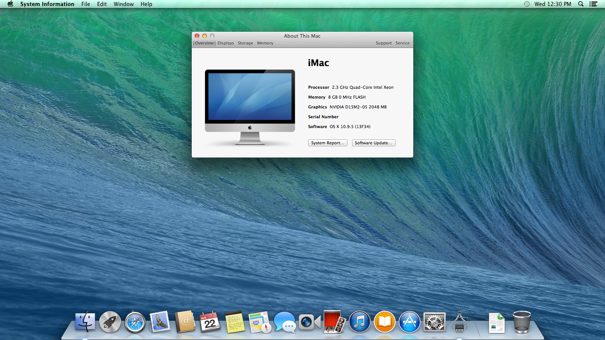
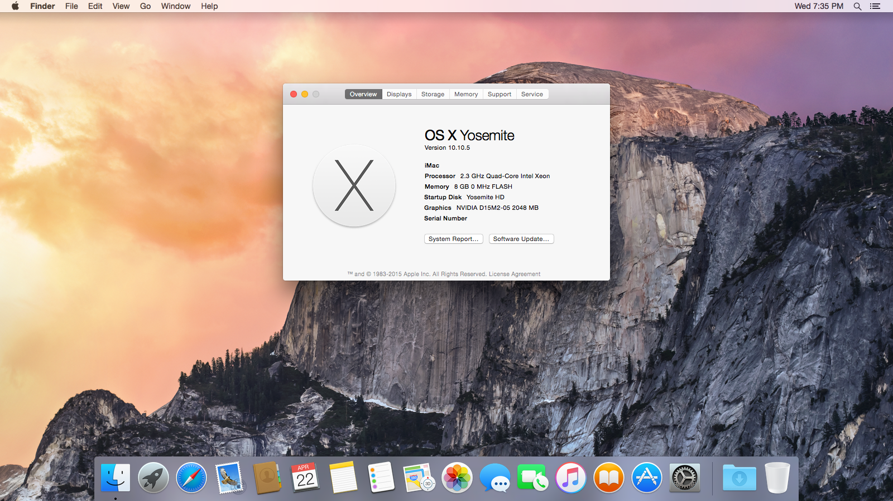
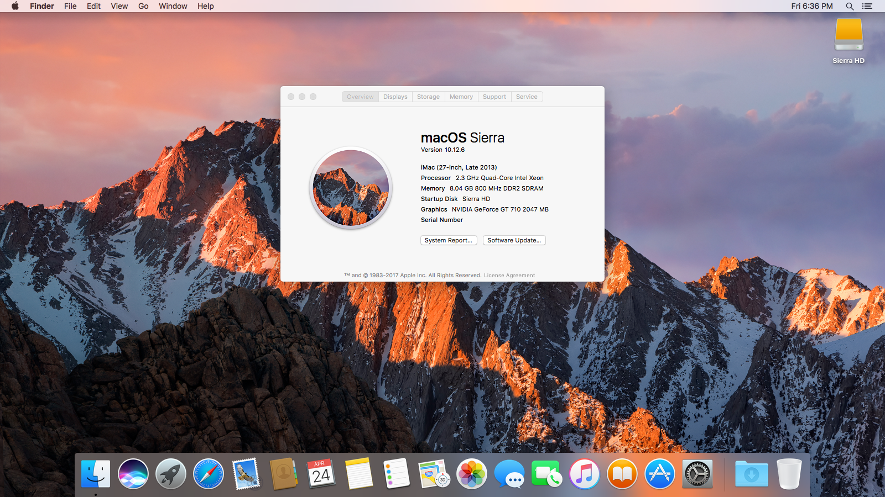
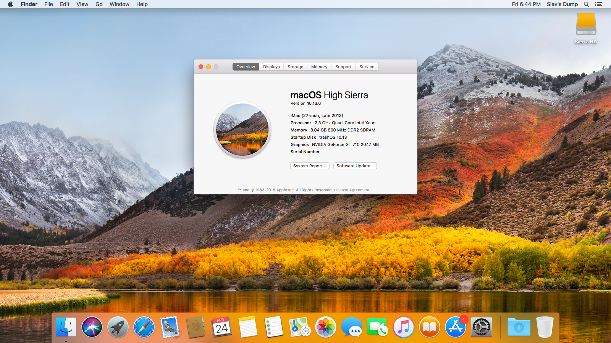
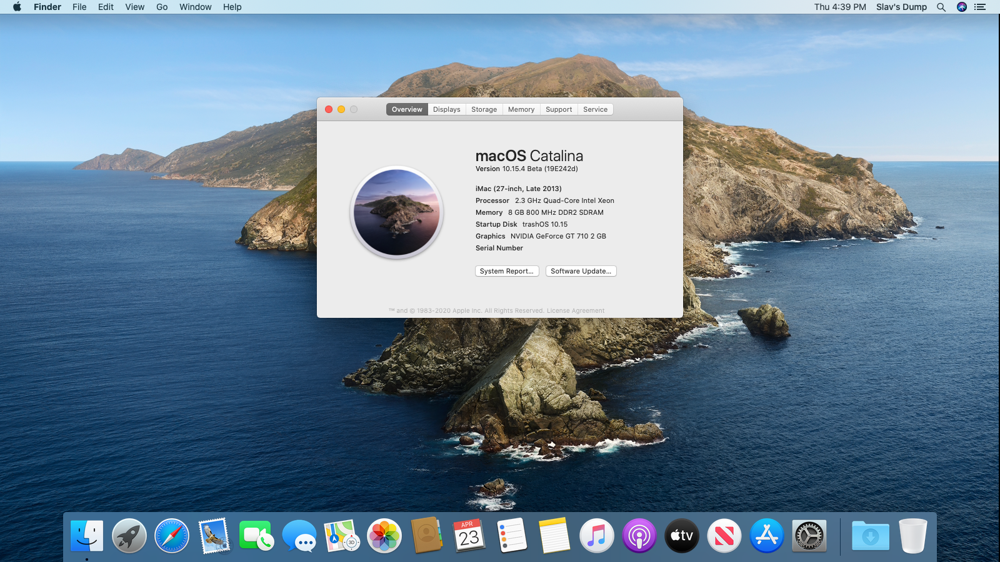
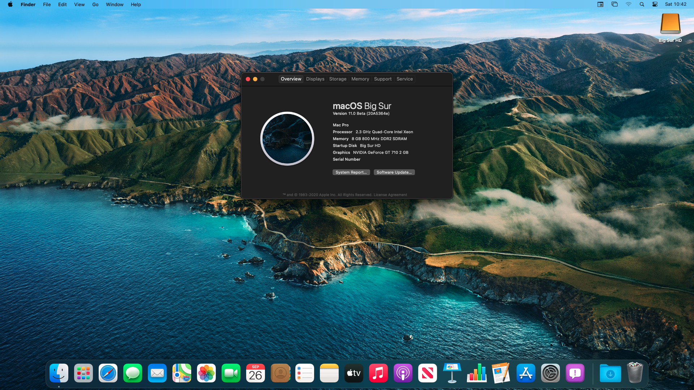

# Tại sao nên chọn OpenCore

Phần này tóm tắt ngắn gọn về lý do tại sao cộng đồng lại chuyển đổi sang OpenCore và nhằm mục đích xóa tan một vài lầm tưởng phổ biến trong cộng đồng. Ai không cần thì có thể bỏ qua trang này.

- [Tại sao nên chọn OpenCore](#tai-sao-nen-chon-opencore)
  - Các tính năng của OpenCore
  - Nhiều phần mềm hỗ trợ
  - Kext injection
- [Khiếm khuyết của OpenCore](#khiem-khuyet-cua-opencore)
- [Lầm tưởng chung](#common-myths)
  - Có phải OpenCore không ổn định vì nó là bản beta?
  - Có phải OpenCore luôn inject SMBIOS và ACPI vào các hệ điều hành (OS) khác phải không?
  - Có phải OpenCore yêu cầu phải cài mới, cài vanilla không?
  - Có OpenCore chỉ hỗ trợ rất ít phiên bản (version) macOS?

## Tính năng của OpenCore

- Hỗ trợ nhiều OS hơn!
  - OpenCore hiện hỗ trợ nhiều version của OS X và macOS một cách tự nhiên mà không cần các vụ hack khó khăn của Clover và Chameleon
  - OpenCore hỗ trợ các OS từ 10.4, Tiger trở lại đây, thâm chí là phiên bản mới nhất 11, Big Sur!
- Trung bình, các hệ thống chạy OpenCore boot nhanh hơn Clover vì ít các patch không cần thiết hơn
- Tính ổn định tổng thể tốt hơn vì các bản patch chính xác hơn nhiều
  - [macOS 10.15.4 update](https://www.reddit.com/r/hackintosh/comments/fo9bfv/macos_10154_update/)
  - AMD OSX patches không cần phải được cập với mọi bản Security update nhỏ
- Tổng quan thì bảo mật tốt hơn ở nhiều mặt:
  - Không cần tắt System Integrity Protection (SIP)
  - Hỗ trợ FileVault 2
  - [Vaulting](https://viopencore.github.io/OpenCore-Post-Install/universal/security.html#Vault) giúp tạo "ảnh chụp" của EFI để ngăn những sửa đổi không mong muốn
  - Thực sư hỗ trợ secure-boot
    - Both UEFI and Apple's variant
- BootCamp switching and boot device selection are supported by reading NVRAM variables set by Startup Disk, just like a real Mac.
- Supports boot hotkey via `boot.efi` - hold `Option` or `ESC` at startup to choose a boot device, `Cmd+R` to enter Recovery or `Cmd+Opt+P+R` to reset NVRAM.

## Nhiều phần mềm hỗ trợ

Đây chính là nguyên nhân chính làm cho ai đó chuyển qua OpenCore từ các bootloaders khác chính là vì OpenCore có nhiều phần mềm hỗ trợ hơn:

- Kexts không còn được test cho Clover:
  - Gặp lỗi với 1 kext? Một developers bao gồm nhóm [Acidanthera](https://github.com/acidanthera) (người viết hầu hết những kexts yêu thích nhất của bạn) sẽ không hỗ trợ trừ khi bạn sử dụng OpenCore
- Một số firmware drivers đã được gộp vào OpenCore:
  - [APFS Support](https://github.com/acidanthera/AppleSupportPkg)
  - [FileVault support](https://github.com/acidanthera/AppleSupportPkg)
  - [Firmware patches](https://github.com/acidanthera/AptioFixPkg)
- [AMD OSX patches](https://github.com/AMD-OSX/AMD_Vanilla/tree/opencore):
  - Bạn đang sử máy chạy AMD? The kernel patches phục vụ việc boot macOS không còn hỗ trợ Clover – chúng chỉ còn hỗ trợ OpenCore.

## Kext Injection

Để hiểu rõ hơn hệ thống kext injection của OpenCore, chúng ta trước tiên nên tìm hiểu cách Clover hoạt động:

1. Patches SIP tắt đi
2. Patches để kích hoạt zombie code của XNU để inject kext injection
3. Patches race condition with kext injection
4. Injects kexts
5. Patches SIP mở trở lại

Những thứ phải ghi nhớ nếu bạn dùng Clover:

- Sử dụng code "zombie" (kiểu siêu cũ) của XNU (đã không được sử dụng từ 10.7, điều này thật là ấn tượng khi Apple đã không loại bỏ code này
  - Những bản cập nhật macOS thường phá vỡ patch này, gần nhất là 10.14.4 và 10.15
- Tắt SIP and cố gắng tự mở nỏ lại, don't think much needs to be said
- Hỗ trợ tất cả OS X đến 10.5

Bây giờ thì hãy xem phương pháp của OpenCore:

1. Takes existing prelinked kernel and kexts ready to inject
2. Rebuilds the cache in the EFI environment with the new kexts
3. Adds this new cache in

Những điều cần lưu ý với phương pháp của OpenCore:

- OS agnostic as the prelinked kernel format has stayed the same since 10.6 (v2), far harder to break support.
  - OpenCore also supports prelinked kernel (v1, found in 10.4 and 10.5), cacheless, Mkext and KernelCollections, meaning it also has proper support for all Intel versions of OS X/macOS
- Far better stability as there is far less patching involved

# Khiếm khuyết của OpenCore

Hầu hết các chức năng của Clover được hỗ trợ trong OpenCore in the form of some quirk, tuy nhiên khi chuyển đổi bạn hãy chú ý cẩn thận về những tính năng bị thiếu của OpenCore vì nó có hoặc không ảnh hưởng tới bạn:

- Không hỗ trợ những hệ điều hành boot dựa trên MBR (ý chỉ không hỗ trợ MBR)
  - Điều này có thể sửa bằng cách cài đặt rEFInd bên cạnh OpenCore
- Không hỗ trợ patch VBIOS của UEFI
  - Nhưng cái này có thể được sửa trong macOS
- Không hỗ trợ tự động inject DeviceProperty cho GPU cũ
  - VD. InjectIntel, InjectNvidia và InjectAti
  - Nhưng cái này có thể làm thủ công: [GPU patching](https://viopencore.github.io/OpenCore-Post-Install/gpu-patching/)
- Không hỗ trợ patch IRQ
  - Có thể sửa bằng cách sử dụng [SSDTTime](https://github.com/corpnewt/SSDTTime)
- Không hỗ trợ state P và C cho các CPU đời cũ
- Không hỗ trợ patch Target Bridge ACPI
- Không hỗ trợ inject UUID phần cứng
- Không hỗ trợ tự động phát hiện bootloader Linux (tuy nhiên do guide này đã cũ aka outdate, từ những phiên bản gần đây đã có sự xuất hiện của OpenLinuxBoot)
- Không hỗ trợ nhiều patch XCPM của Clover (VD: Patch XCPM của Ivy Bridge)
- Không hỗ trợ ẩn ổ cứng cụ thể
- Không hỗ trợ thay đổi cài đặt trong menu boot OpenCore (VD: tắt/bật kext, thay đổi giá trị boot của iGPU...)
- Không hỗ trợ patch UID value của PCIRoot
- Không hỗ trợ patch và inject ACPI chỉ của macOS (bản gốc: Does not support macOS-only ACPI injection and patching)

# Những câu hỏi và đồn đoán

## Có phải OpenCore không ổn định vì nó là beta?

Câu trả lời ngắn: Không

Câu trả lời dài: Không

Số phiên bản của OpenCore không tái hiện lại chất lượng của dự án. Thay vào đó, it's more of a way to see the stepping stones of the project. Acidanthera still has much they'd like to do with the project including overall refinement and more feature support.

For example, OpenCore goes through proper security audits to ensure it complies with UEFI Secure Boot, and is the only Hackintosh bootloader to undergo these rigorous reviews and have such support.

Version 0.6.1 was originally designed to be the official release of OpenCore as it would have proper UEFI/Apple Secure Boot, and would be the 1 year anniversary of OpenCore's release as a public tool. However, due to circumstances around macOS Big Sur and the rewriting of OpenCore's prelinker to support it, it was decided to push off 1.0.0 for another year.

Current road map:

- 2019: Year of Beta
- 2020: Year of Secure Boot
- 2021: Year of Refinement

So please do not see the version number as a hindrance, instead as something to look forward to.

## Does OpenCore always inject SMBIOS and ACPI data into other OSes

By default, OpenCore will assume that all OSes should be treated equally in regards to ACPI and SMBIOS information. The reason for this thinking consists of three parts:

- This allows for proper multiboot support, like with [BootCamp](https://viopencore.github.io/OpenCore-Post-Install/multiboot/bootcamp.html)
- Avoids poorly made DSDTs and encourages proper ACPI practices
- Avoids edge cases where info is injected several times, commonly seen with Clover
  - i.e. How would you handle SMBIOS and ACPI data injection once you booted boot.efi, but then get kicked out? The changes are already in memory and so trying to undo them can be quite dangerous. This is why Clover's method is frowned upon.

However, there are quirks in OpenCore that allow for SMBIOS injection to be macOS-limited by patching where macOS reads SMBIOS info from. The `CustomSMIOSGuid` quirk with `CustomSMBIOSMode` set to `Custom` can break in the future and so we only recommend this option in the event of certain software breaking in other OSes. For best stability, please disable these quirks.

## Does OpenCore require a fresh install

Not at all in the event you have a "Vanilla" installation – what this refers to is whether the OS has tampered in any way, such as installing 3rd party kexts into the system volume or other unsupported modifications by Apple. When your system has been heavily tampered with, either by you or 3rd party utilities like Hackintool, we recommend a fresh install to avoid any potential issues.

Special note for Clover users: please reset your NVRAM when installing with OpenCore. Many of Clover variables can conflict with OpenCore and macOS.

- Lưu ý: Laptop Thinkpad được biết có thể bị semi-bricked sau khi reset NVRAM trong OpenCore, chúng tôi khuyến khích hãy reset NVRAM thông qua việc update BIOS trên những chiếc máy .

## Does OpenCore only support limited versions of macOS

As of OpenCore 0.6.2, you can now boot every Intel version of macOS going all the way back to OS X 10.4! Proper support however will depend on your hardware, so please verify yourself: [Hardware Limitations](macos-limits.md)

::: details macOS Install Gallery

Acidanthera has tested many versions, and I myself have run many versions of OS X on my old HP DC 7900 (Core2 Quad Q8300). Here's just a small gallery of what I've tested:

:::

## Does OpenCore support older hardware

As of right now, the majority of Intel hardware is supported so long as the OS itself does! However please refer to the [Hardware Limitations page](macos-limits.md) for more info on what hardware is supported in what versions of OS X/macOS.

Currently, Intel's Yonah and newer series CPUs have been tested properly with OpenCore.

## Does OpenCore support Windows/Linux booting

OpenCore works in the same fashion as any other boot loader, so it respects other OSes the same way. For any OSes where their bootloader has an irregular path or name, you can simply add it to the BlessOverride section.

## Legality of Hackintoshing

Where hackintoshing sits is in a legal grey area, mainly that while this is not illegal we are in fact breaking the EULA. The reason this is not illegal:

- We are downloading macOS from [Apple's servers directly](https://github.com/acidanthera/OpenCorePkg/blob/0.6.9/Utilities/macrecovery/macrecovery.py#L125)
- We are doing this as a non-profit origination for teaching and personal use
  - People who plan to use their Hackintosh for work or want to resell them should refer to the [Psystar case](https://en.wikipedia.org/wiki/Psystar_Corporation) and their regional laws

While the EULA states that macOS should only be installed on real Macs or virtual machines running on genuine Macs ([sections 2B-i and 2B-iii](https://www.apple.com/legal/sla/docs/macOSBigSur.pdf)), there is no enforceable law that outright bans this. However, sites that repackage and modify macOS installers do potentially risk the issue of [DMCA takedowns](https://en.wikipedia.org/wiki/Digital_Millennium_Copyright_Act) and such.

- **Note**: This is not legal advice, so please make the proper assessments yourself and discuss with your lawyers if you have any concerns.

## macOS có hỗ trợ GPU của Nvidia không?

Due to issues revolving around Nvidia support in newer versions of macOS, many users have somehow come to the conclusion that macOS never supported Nvidia GPUs and don't at this point. However, Apple actually still maintains and supports Macs with Nvidia GPUs in their latest OS, like the 2013 MacBook Pro models with Kepler GPUs.

The main issue has to do with any newer Nvidia GPUs, as Apple stopped shipping machines with them and thus they never had official OS support from Apple. Instead, users had to rely on Nvidia for 3rd party drivers. Due to issues with Apple's newly introduced Secure Boot, they could no longer support the Web Drivers and thus Nvidia couldn't publish them for newer platforms limiting them to mac OS 10.13, High Sierra.

For more info on OS support, see here: [GPU Buyers Guide](https://viopencore.github.io/GPU-Buyers-Guide/)
